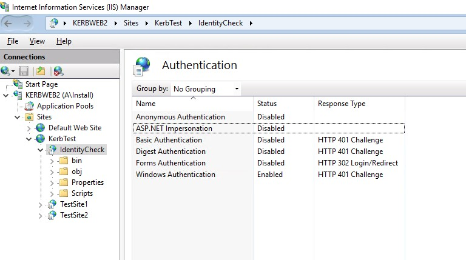

# Kerberos 101 Labs

## Impersonation

Now we want to see how impersonation changes the behavior of a web site.

:ballot_box_with_check: Add the following entry to the Local Intranet Zone: `*.a.vm.net`. Without this entry, your browser will not even try to use Windows Integrated Authentication (Kerberos, NTLM).
:ballot_box_with_check: Please navigate to the web site `http://kerbtest.a.vm.net/IdentityCheck`.

The web page should show this:

```text
Thread Identity: A\Install

WindowsIdentity: A\KerbTestService

WhoAmI: a\kerbtestservice
```

:question: Why is the 'WindowsIdentity' and the result of `whoami.exe` indicating, that the web sites is running with the identity `a\kerbtestservice`?

> :warning: The field `Thread Identity` only shows the identity of the incoming user. It does not mean that the application does have access to the user's access token.

:ballot_box_with_check: Try to access the following paths by entering the paths into the text field at the bottom and pressing the button `Access folder`:

```
c:\
\\a.vm.net\sysvol
```

The result should be like `Folder has 1 items`.

---

Now we want to enable impersonation via the `Internet Information Services (IIS) Manager` on the machine `KerbWeb2`.

:ballot_box_with_check: Logon to machine `KerbWeb2`
:ballot_box_with_check: Please open the `Internet Information Services (IIS) Manager`.
:ballot_box_with_check: Navigate to the web site `KerbTest` and then the virtual directory `IdentityCheck`.
:ballot_box_with_check: Then open the menu `Authentication`



:ballot_box_with_check: Now right click on the option `ASP.NET Impersonation` and enable it.

:ballot_box_with_check: On `KerbClient`, refresh the web page.

:ballot_box_with_check: Try to access the sysvol folder again

:question: Why does accessing the sysvol folder fail?
:question: What has changed?

<details><summary><h2>Lessons Learned</h2></summary>

:bulb:

:bulb:

</details>
