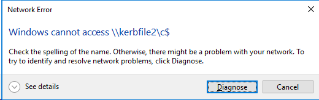
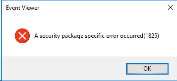

# Kerberos 101 Labs

## Troubleshooting SPNs Part 2

This lab covers another well-known issue: SPN registered on the wrong account.

SPNs are unique identifiers for services running on servers. Every service that will use Kerberos authentication needs to have an SPN set for it so that clients can identify the service on the network. If an SPN is not set for a service, then clients will have no way of locating that service. Without properly set SPNs, Kerberos authentication is not possible.

An SPN is registered in Active Directory under a user account as an attribute called Service-Principal-Name. The SPN is assigned to the account under which the service the SPN identifies is running. Any service can look up the SPN for another service. When a service wants to authenticate to another service, it uses that service's SPN to differentiate it from all of the other services running on that computer.

:ballot_box_with_check: Do a fresh logon on the client machine and also restart the file server.

:ballot_box_with_check: Open a PowerShell and invoke the functions `Repair-Lab4` and `Start-Lab5`.

> :warning: Please note the computer name returned by the function `Start-Lab5`.

:ballot_box_with_check: Open Wireshark and start a network trace again.

:ballot_box_with_check: Browse to the `c$` share of the machine returned by `Start-Lab5`.

:ballot_box_with_check: Stop the network trace.

You are not be able to connect to the machine’s `c$` share and get the following error:



Various network services are not accessible anymore. Now we try connecting to the event log of the machine. You might want to start a new network trace.



Interestingly, the error messages are totally different.

It is time to analyze the network trace. We see a lot of `TGS-REQ` and `TGS-REP` frames but also many messages with the error code `KRB5KRB_AP_ERR_MODIFIED`.

In general, when information cannot be decrypted by Kerberos, it throws the error `KRB_AP_ERR_MODIFIED`, meaning that the encrypted information is not accessible, but giving no further information why. Kerberos does not know because there are multiple reason, for example:

- the data could have been modified in transit by an attacker
- the data could have been malformed initially
- or there could be no available key

Each of these possible causes requires troubleshooting at different locations and using different techniques.

:question: What might be the cause for the problem?

:question: What could be the cause why the Kerberos client is not be able to decrypt a ticket?

<details><summary><h2>Lessons Learned</h2></summary>

:ballot_box_with_check: Please check the SPN registered on the file server. You can use `dsa.msc` for that or PowerShell

```powershell
Get-ADComputer -Identity KerbFile2 -Properties ServicePrincipalName | Select-Object -ExpandProperty ServicePrincipalName
```

:ballot_box_with_check: Compare the SPNs of the `KerbFile2` computer account with the SPNs registered to another computer account, let's say `KerbWeb2`.

:question: Which is missing?

<details><summary>:question: When you know which SPN is missing, how can it be fixed?</summary>

The `HOST` SPN is missing on the computer account `KerbFile2`.  As the Kerberos client still retrievs tickets for that service from the KDC so the SPN `HOST/KerbFile2` must exist somewhere else, on another computer or user account. 

:ballot_box_with_check: Lets find the account:

```powershell
Get-ADComputer -Filter { ServicePrincipalName -eq 'HOST/KERBFILE2' }
```
You can either correct the SPNs manually using `dsa.msc`, `setspn.exe` or PowerShell or you can use the cmdlet `Repair-Lab5`.

</details>

:bulb: Application usually do not tell about the underlying Kerberos problem. The authentication simply fails and throws a generic error.

:bulb: Two different error messages have the same root that is actually a decryption problem.

:bulb: Registering SPNs on the wrong account has more serious consequences than not registering SPNs.

</details>
